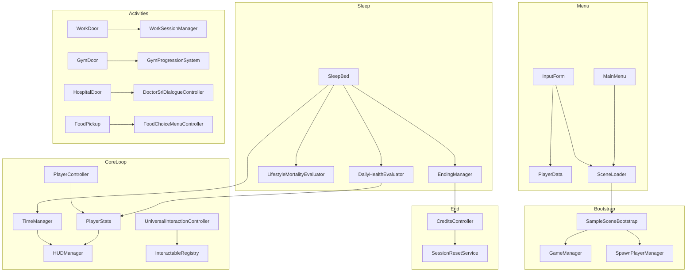

# Dokumentasi Teknis HealthSim — Laporan TA (Skripsi)

> **Cakupan:** Seluruh script di `Assets/_Project/Scripts/` (157 file C#) beserta dependensi runtime yang dipanggil dari luar folder tersebut (mis. `BazaarManager`).  
> **Tujuan:** Memetakan alur game, sistem gameplay, angka-angka perhitungan, dan hubungan antar komponen untuk keperluan dokumentasi skripsi.  
> **Catatan:** Nama class, method, dan variable ditulis dalam format kode (`backtick`).

---

## Daftar Isi

1. [Ringkasan Game](#1-ringkasan-game)
2. [Alur Game dari Awal sampai Credits](#2-alur-game-dari-awal-sampai-credits)
3. [Tabel Konstanta Numerik Penting](#3-tabel-konstanta-numerik-penting)
4. [Arsitektur & Singleton](#4-arsitektur--singleton)
5. [Sistem Inti (Core)](#5-sistem-inti-core)
6. [Sesi, Bootstrap & Spawn](#6-sesi-bootstrap--spawn)
7. [Kesehatan, Skor, Aging & Ending](#7-kesehatan-skor-aging--ending)
8. [Waktu, Tidur & Siklus Hari](#8-waktu-tidur--siklus-hari)
9. [Energi, Pingsan & Lalu Lintas](#9-energi-pingsan--lalu-lintas)
10. [Makanan, Stash & Bazaar](#10-makanan-stash--bazaar)
11. [Kerja (Work)](#11-kerja-work)
12. [Gym](#12-gym)
13. [Rumah Sakit & Dialog Dokter](#13-rumah-sakit--dialog-dokter)
14. [Interaksi & Dialog NPC](#14-interaksi--dialog-npc)
15. [UI, HUD, Tutorial & Modal](#15-ui-hud-tutorial--modal)
16. [Cerita, Intro & Cutscene](#16-cerita-intro--cutscene)
17. [Pemain, Kamera & Model Karakter](#17-pemain-kamera--model-karakter)
18. [NPC Kota & Lalu Lintas](#18-npc-kota--lalu-lintas)
19. [Main Menu & Input Karakter](#19-main-menu--input-karakter)
20. [Tracking & Branching](#20-tracking--branching)
21. [Peta Dependensi Antar Sistem](#21-peta-dependensi-antar-sistem)
22. [Script Editor (Ringkas)](#22-script-editor-ringkas)
23. [Riwayat Pembaruan & Kelengkapan Dokumen](#23-riwayat-pembaruan--kelengkapan-dokumen)

---

## 1. Ringkasan Game

**HealthSim** adalah simulasi kehidupan sehari-hari berdurasi **12 hari in-game** (3 fase usia: Muda → Dewasa → Lansia). Pemain mengelola:

- **Energi & mood** melalui makan, istirahat, dan aktivitas
- **Pola makan** (kalori, protein, lemak) terhadap target AKG Indonesia per fase/gender
- **Kerja** (kantor sub-scene) untuk uang
- **Gym** (sub-scene) untuk adaptasi fisik
- **Rumah sakit** untuk konsultasi dr. Sri saat skor kesehatan rendah
- **Tidur** sebagai titik evaluasi harian dan transisi hari

**Kondisi akhir:**

| Hasil | Pemicu |
|-------|--------|
| Ending Baik / Netral / Buruk | Tidur di **Hari 12**; rata-rata skor 3 fase dibanding threshold gender |
| Kematian Dini (Premature Death) | Roll risiko saat tidur **Hari 5–11** jika pola hidup buruk |
| Credits | Setelah panel ending + recap |

---

## 2. Alur Game dari Awal sampai Credits

```
MainMenu → InputMenu (profil) → LoadingScreen → SampleScene
    ↓
SampleSceneBootstrap: pasang manager, load PlayerData, spawn player
    ↓
StoryIntroManager: cutscene aerial + backstory (sekali, kecuali dipaksa)
    ↓
TutorialSequentialUI + TutorialContextualUI
    ↓
LOOP HARIAN (Hari 1–12, jam 06:00–24:00, 270 detik nyata):
    • Jelajahi kota (makan, NPC, gym, kantor, rumah sakit, bazaar)
    • Energi habis → pingsan → recovery
    • Malam → tidur di kasur → evaluasi harian → hari baru
    • Hari 5 & 10 → transisi fase usia + panel aging
    • Hari kelipatan 5 → kemungkinan Bazaar Sehat
    ↓
Hari 12 tidur → EndingManager.TriggerEnding()
    → Dialog dr. Sri → Panel ending → Recap → CreditsController → MainMenu
```

**Sub-scene (fade load, kembali via `SubSceneReturnHelper`):**

- `OfficeScene` — kerja (spawn `officedoor`)
- `GymScene` — latihan (spawn `gymdoor`)

---

## 3. Tabel Konstanta Numerik Penting

### Waktu & Fase

| Parameter | Nilai | Script |
|-----------|-------|--------|
| Durasi 1 hari nyata | **270 detik** (4m30s) | `TimeManager.totalGameDuration` |
| Override serialized (prefab) | **270** | `MobileJoystickUI.prefab` → komponen `TimeManager` |
| Jam in-game | **06:00 – 24:00** | `TimeManager` |
| 4 periode (masing-masing 25% hari) | Pagi, Siang, Sore, Malam | `TimeManager` |
| Jam kerja | **07:00 – 15:00** | `FacilityHours` |
| Jam gym | **06:00 – 22:00** | `FacilityHours` |
| Reminder tidur | mulai jam **22:00**, ulang tiap **60s** | `TimeManager` |
| Hari ending | **12** | `EndingManager` |

### Fase Usia

| Fase | Hari | Label Indonesia |
|------|------|-----------------|
| `Youth` | 1–4 | Muda |
| `Adult` | 5–9 | Dewasa |
| `Senior` | 10–12 | Lansia |

### Energi & Pingsan

| Parameter | Nilai |
|-----------|-------|
| Energi maks awal | 100 |
| Drain idle / jalan / lari (base) | 0.2 / 0.45 / 0.95 per detik |
| Skala drain gerak (`movementDrainScale`) | 0.30 |
| Threshold Warning / Critical | 40% / 15% |
| Durasi di 0 energi sebelum pingsan | **3 detik** |
| Recovery pingsan (`EnergySystem`) | +30 energi, -10 mood |
| Delay respawn | 2 detik |
| Knockdown kendaraan | drain **12%** max energi (bukan pingsan penuh) |
| Kecepatan saat Warning / Critical | ×0.7 / ×0.4 |

### Ekonomi & Makanan

| Parameter | Nilai |
|-----------|-------|
| Uang awal | **500** |
| Harga rumah (`homePriceMultiplier`) | ×0.65 |
| Harga restoran default | ×1.0 outlet |
| Diskon bazaar | ×0.5 |

### Target Kalori Harian (AKG disederhanakan)

| Fase | Laki-laki | Perempuan |
|------|-----------|-----------|
| Muda | 2600 | 2100 |
| Dewasa | 2400 | 1950 |
| Lansia | 2050 | 1700 |

### Skor Kesehatan Harian (`DailyHealthEvaluator`)

| Area | Bobot |
|------|-------|
| Diet (bonus maks) | +4 |
| Diet junk semua | -3 |
| Tidak makan | -1.5 |
| Kalori <50% / >130% target | -1 masing-masing |
| Protein <40g / lemak >65g | -1 masing-masing |
| Tidur normal / terganggu | +1 / 0 |
| Tidur energi <20% | -1 |
| Gym Excellent / Solid / Strained | +3 / +2 / +1 |
| Skip gym streak (≥3 hari) | -1.5 per hari ekstra |
| Kerja Full (+bonus) / Partial / Failed | +2 (+2 bonus) / +0.5 / -1.5 |
| Skip kerja streak (≥2 hari) | -2 per hari ekstra |
| **Clamp total harian** | **-8 s/d +12** |

### Kerja (`WorkSessionManager`)

| Parameter | Nilai |
|-----------|-------|
| Gaji dasar Pagi / Siang / Sore | 200 / 150 / 150 |
| Energi minimum kerja | 10% |
| Drain energi Full / Partial | 20% / 11% |
| Threshold gagal / bonus | 30% / 60% |
| Multiplier bonus gaji | ×1.25 |

### Gym (`GymProgressionSystem`)

| Parameter | Nilai |
|-----------|-------|
| Energi minimum latihan | 15% |
| Biaya energi dasar | 10% |
| Durasi sesi | 2 jam (1 jam di sore) |
| Tier adaptasi Regular / Advanced | ≥25 / ≥55 |
| Quality Excellent / Strained | ≥0.72 / <0.45 |
| Recovery fatigue saat tidur | -7.5 |

### Mortalitas (`LifestyleMortalityEvaluator`)

| Parameter | Nilai |
|-----------|-------|
| Perlindungan fase muda | sampai **Hari 4** |
| Chance maksimum | **18%** |
| Kunjungan RS mengurangi chance | ×0.45 (min 1%) |
| Senior multiplier | ×1.65 |
| Pola buruk kronis | diet buruk ≥40%, skip gym ≥45%, tidur terganggu ≥35% |

### Ending (`EndingManager`)

| Gender | Baik | Netral |
|--------|------|--------|
| Perempuan | avg ≥65 | avg ≥40 |
| Laki-laki | avg ≥70 | avg ≥45 |

### Perubahan Berat saat Transisi Fase (`PlayerStats`)

| Skor fase | Δ berat |
|-----------|---------|
| <40 | +3.5 kg |
| <60 | +1.5 kg |
| >75 | -2.0 kg |
| lainnya | +0.5 kg |

### BMI (`PlayerData` / `CharacterModelSwapper`)

| Kategori | BMI |
|----------|-----|
| Kurang | <18.5 |
| Normal | 18.5–24.9 |
| Gemuk | 25–29.9 |
| Obesitas | ≥30 |

---

## 4. Arsitektur & Singleton

### Host `GameManager` (DontDestroyOnLoad)

`SampleSceneBootstrap.EnsureCoreManagers()` memastikan komponen berikut ada di satu host persisten:

`SessionSeedManager`, `PlayerActionTracker`, `StoryIntroManager`, `StoryManager`, `IntroCutsceneController`, `SessionFlowController`, `FoodChoiceMenuController`, `FoodStashMenuController`, `NpcDialogueMenuController`, `FoodCatalogProvider`, `DialogueCatalogProvider`, `SessionFoodStash`, `ModalStateManager`, `WorkReminderUI`, `TimeManager`, `WorkSessionManager`, `GymProgressionSystem`, `SessionTimeSkipPresenter`, `ClockAnimationUI`, `HealthAlertPanelController`, `FadeManager`, `MobileInputController`, `BazaarManager`, `EndingManager`, `CreditsController`, `GameplayAudioListenerKeeper`

### Singleton lain

| Class | Peran |
|-------|-------|
| `PlayerStats` | State pemain utama |
| `SpawnPlayerManager` | Teleport player ke spawn point |
| `HUDManager` | HUD energi/mood/kalori/jam |
| `FadeManager` | Fade scene & input block |
| `ModalStateManager` | Kunci input saat modal terbuka |

### Reset sesi penuh

`SessionResetService.ResetAllForMenuExit()` — dipanggil saat keluar ke menu / selesai credits. Mereset stats, waktu, stash, kerja, gym, tracker, dan flag intro.

---

## 5. Sistem Inti (Core)

### `PlayerStats`

**Fungsi:** Pusat data runtime pemain — energi, mood, kalori, protein, lemak, uang, skor kesehatan fase, aging, BMI/berat, kunjungan RS, streak gym/kerja.

**Field penting:**

- `maxEnergy` = 100, `currentEnergy` = 100
- `warningThreshold` = 40, `criticalThreshold` = 15
- `healthScoreThisPhase` = 50 (reset ke 50 tiap transisi fase)
- `committedPhaseScores[3]` = {50, 50, 50} — skor per fase Muda/Dewasa/Lansia
- `_money` = 500
- `trainingAdaptation`, `fatigueDebt` — progres gym tersembunyi

**Method krusial:**

| Method | Alur |
|--------|------|
| `DrainEnergy(isWalking, isRunning, dt)` | Hitung drain berdasarkan aktivitas × `movementDrainScale` × modifier fase × grace pasca-aktivitas (×0.55) |
| `AddFood(energy, calories, mood, protein, fat, countsAsMeal)` | Tambah nutrisi; meal menghapus travel grace |
| `RegisterHealthScore(delta)` | Tambah/kurangi skor fase; clamp 0–100 |
| `RegisterDailyHealthSnapshot(...)` | Catat statistik harian untuk mortality & phase review |
| `SyncDayAndTryAdvanceAgeStage(day, out prev, out next)` | Commit skor fase lama, reset skor ke 50, ubah modifier energi (×0.9/1.0/1.1), shift berat, reset streak |
| `FaintAndRespawn()` | Fade hitam → energi penuh → state Fainted → panel pingsan |
| `HandleVehicleKnockdown()` | Drain 12% energi + notifikasi (bukan pingsan penuh) |
| `GetSpeedMultiplier()` | 1.0 / 0.7 / 0.4 / 0 berdasarkan state energi |
| `ShouldShowHealthGuidance(threshold=40)` | Gate UI peringatan RS |
| `SetVisitedHospital()` | Tandai kunjungan RS + dismiss guidance |
| `ResetForNewSession(...)` | Reset total untuk run baru |
| `GetAveragePhaseScore()` | Rata-rata 3 skor fase untuk ending |

**Event:** `OnEnergyStateChanged`, `OnPlayerFainted`, `OnEnergyChanged`, `OnMoodChanged`, `OnCaloriesChanged`, `OnAgeStageChanged`, `OnHealthGuidanceIndicatorsUnlocked`

---

### `TimeManager`

**Fungsi:** Jam in-game, periode hari, pergantian hari, reminder tidur.

**Field penting:** `totalGameDuration` = **270f** (default script). Nilai di Inspector prefab `MobileJoystickUI` ikut diset **270** agar tidak tertimpa default lama.

**Method krusial:**

| Method | Alur |
|--------|------|
| `EnsureExists()` / `AutoEnsureForGameplayScene()` | Bootstrap otomatis di scene gameplay |
| `StartGame()` | Reset waktu, Hari 1, Senin |
| `AdvanceToNextDayFromSleep()` | `currentDayNumber++`, rotasi nama hari, reset ke pagi |
| `SetTimeByHour(6–24)` | Set posisi waktu dalam hari |
| `Update()` | Tick timer; `OnGameTimeUp` saat hari habis; cek periode |
| `CurrentHour` | `6 + (TimePercent × 18)` |

**Event:** `OnPeriodChanged`, `OnGameTimeUp`, `OnDayChanged`

---

### `EnergySystem`

**Fungsi:** Handler recovery pingsan alternatif (terhubung ke event `PlayerStats`).

**Method krusial:**

- `HandleFaint()` — kunci `PlayerController`, coroutine respawn 2 detik
- `Respawn()` — teleport spawn, `AddFood(30 energi, 0 kal, -10 mood)`
- `CompleteFaintRecovery()` — dipanggil saat panel pingsan ditutup

---

### `FacilityHours`

**Fungsi:** Jam operasional fasilitas (static).

- `IsWorkOpen()` — jam 7–15
- `IsGymOpen()` — jam 6–22

---

### `FoodData` (ScriptableObject)

**Fungsi:** Definisi item makanan.

**Default:** 200 kal, 20 energi, +5 mood, 8 lemak, 6 protein, 24 karbo.

**Method krusial:**

- `IsAvailableAt(TimePeriod)` — filter waktu makan
- `GetEffectivePrice()` — fallback harga 12–33 berdasarkan kategori
- `IsJunkFood` — `!isHealthy || FastFood`

---

### `EndingManager`

**Fungsi:** Presentasi akhir game.

**Method krusial:**

| Method | Alur |
|--------|------|
| `TriggerEnding()` | Hitung `GetAveragePhaseScore()` → Good/Neutral/Bad → dialog dr. Sri → `ShowEndingRoutine` |
| `TriggerPrematureDeath(assessment, day)` | Ending kematian dini + penyebab |
| `ShowEndingRoutine()` | Typewriter narasi → panel recap (6 risiko penyakit) → `CreditsController.Play()` |
| `BuildDoctorDialogue(...)` | Graph dialog 4 node procedural |

**Risiko penyakit:** 6 kondisi (diabetes, hipertensi, dll.) dihitung dari rasio pola hidup buruk; threshold risiko 0.20 / 0.35.

---

### `MixamoAvatarReference` (ScriptableObject)

Menyimpan referensi `Avatar` Mixamo untuk binding animator saat swap model.

---

## 6. Sesi, Bootstrap & Spawn

### `SampleSceneBootstrap`

**Fungsi:** Orkestrator masuk `SampleScene`.

**Alur `RunSceneEntryRoutine`:**

1. `AudioListenerEnforcer.EnforceSingleListener()`
2. `EnsureCoreManagers()` — 20+ komponen di `GameManager`
3. `EnsureEventSystemSetup()`, `EnsurePlayerInteraction()`, proximity button
4. `PlayerData.Load()` → `PlayerStats.SetPlayerData` + `SetGender`
5. `EnsurePlayerCharacterSwapper()`
6. Tunggu `SpawnPlayerManager.SpawnWhenPlayerReady()`
7. `RunIntroSequence()` — skip jika kembali dari sub-scene

**Field:** `forceIntroEveryPlay` = false

---

### `SpawnPlayerManager`

**Fungsi:** Teleport player ke `SpawnPointID` saat `SampleScene` load.

**Method krusial:**

- `TargetSpawnID` (static) — di-set door interactable sebelum load scene
- `SpawnWhenPlayerReady()` — coroutine tunggu player + snap ground
- `IsReturningFromSubSceneLoad()` — deteksi kembali dari Office/Gym
- `DefaultSpawnId` = `"spawnpoint"`

---

### `SpawnPointID` / `PlayerPersist`

- `SpawnPointID` — marker ID spawn di scene (`officedoor`, `gymdoor`, `spawnpoint`, dll.)
- `PlayerPersist` — DDOL player; `DestroyForNewSession()` saat restart dari menu

---

### `SessionResetService`

`ResetAllForMenuExit()` — destroy persist, reset semua manager, clear PlayerPrefs intro/backstory.

---

### `SessionSeedManager`

RNG deterministik per sesi: seed dari tanggal atau manual (`manualSeed` = 123456). Dipakai `StoryIntroManager` untuk memilih template intro.

---

### `SubSceneReturnHelper`

- `ReturnToSampleScene(spawnId, scene, activateTravelGrace)` — fade 0.28s + set spawn + optional travel grace
- `WaitForDialogue` — timeout 90s

---

### `SessionTimeSkipPresenter`

Antrian animasi skip jam saat kembali dari sub-scene. Durasi default **3.5 detik** (min 0.8s). Memanggil `ClockAnimationUI` lalu `TimeManager.SetTimeByHour`.

---

### `SessionFoodStash`

Inventori makanan persisten antar scene.

- `Add` / `RemoveAt` / `ConsumeAt` → `PlayerStats.AddFood` + `StoryManager.OnFoodEaten`
- Event `OnStashChanged`

---

### `StoryManager`

Hook ringan: `OnFoodEaten` → update trust NPC ±1 via `NpcDialogueInteractable`.

---

### `SessionFlowController`

Dengarkan `TimeManager.OnGameTimeUp`; log hasil `PlayerActionTracker.EvaluateBranchOutcome()` (Healthy/Risky/Mixed). **Tidak** memicu ending langsung.

---

### `WorkSessionController` / `OfficeSceneSpawnController` / `OfficeBossDialogueController`

**Office flow:**

1. `OfficeSceneSpawnController` — posisikan player di spawn kantor
2. `OfficeBossDialogueController` — dialog pre-work → `WorkSessionManager.RequestWorkStartFromBossDialogue()`
3. `WorkSessionController.RunFlow` — sembunyikan player → dialog energi → animasi jam kerja → `ApplyResult` → dialog post → `SubSceneReturnHelper` dengan travel grace

---

### Audio guards

- `AudioListenerEnforcer` — satu listener aktif
- `GameplayAudioListenerKeeper` — poll tiap 0.5s
- `SceneAudioListenerGuard` — per-scene camera listener

---

## 7. Kesehatan, Skor, Aging & Ending

### `DailyHealthEvaluator` (file: `Dailyhealthevaluator.cs`)

**Entry point:** `Evaluate(disturbedSleep, energyBeforeSleep, workedToday, lastWorkSession, lastWorkHadBonus, trainedToday, lastGymSession, tracker, stats)`

Dipanggil dari `SleepBedInteractable.ApplyRecovery()` **sebelum** reset harian.

**Output:** `DailyHealthResult` dengan `dietScore`, `sleepScore`, `gymScore`, `workScore`, `totalDelta`, catatan teks.

**Catatan kerja (`workNote`) saat evaluasi:**

| Hasil kerja | Teks `workNote` |
|-------------|-----------------|
| Full | `Kerja selesai.` |
| Full + bonus energi | `Kerja selesai dengan bonus energi!` |
| Partial | `Kerja selesai, tapi tidak optimal.` |
| Failed | `Sesi kerja gagal karena energi habis.` |
| Skip (streak) | `Sudah N hari tidak kerja...` |

---

### `LifestyleMortalityEvaluator`

**Entry point:** `Assess(currentDay, endingDay, stats, tracker)` → `MortalityAssessment` (chance, warning, primary cause)

**Roll:** `RollMortality(chance)` — `Random.value < chance`

Dipanggil di `SleepBedInteractable` **sebelum** advance hari (kecuali Hari 12).

---

### `PhaseReviewBuilder`

Membangun teks narasi transisi fase untuk panel aging dari `PhaseReviewInput` (skor, snapshot aktivitas, gender).

**Label skor:** ≥75 sangat baik, ≥65 baik, ≥50 cukup, ≥40 kurang konsisten, else perlu perhatian.

**Threshold isu:** pola buruk ≥30–40% hari dalam fase.

---

## 8. Waktu, Tidur & Siklus Hari

### `SleepBedInteractable`

**Fungsi:** Sistem tidur paling kompleks — konfirmasi, cinematic, evaluasi, mortality, aging, wake UI.

**Syarat tidur:** periode Malam (`requireNightToSleep` = true); konfirmasi double-tap E (window 2.2s).

**Alur `BeginSleepRoutine` (ringkas):**

1. Snapshot: kerja/gym kemarin, energi, pola diet
2. Roll `disturbedSleep` (base 5%; +20% no work; +25% overwork; +15% poor diet; multiplier 1.6)
3. Roll `lateWakePenalty` dari sinyal gula, overwork, fatigue, energi rendah (cap 75%)
4. Lock input → pre-sleep cinematic → fade hitam
5. `ClockAnimationUI` skip jam 21:00 → jam bangun (7 / 8 / 9)
6. `ApplyRecovery` → `DailyHealthEvaluator.Evaluate` → `RegisterHealthScore`
7. `LifestyleMortalityEvaluator.Assess` + roll → kematian dini ATAU lanjut
8. `AdvanceToNextDayFromSleep` → `BazaarManager.TrySpawnBazaar` → `SyncDayAndTryAdvanceAgeStage`
9. Reset kerja/gym/harian RS; modifier drain besok; wake cinematic + peringatan
10. Jika transisi fase → `ShowAgingNotificationRoutine` + `PhaseReviewBuilder`
11. **Hari 12:** langsung `EndingManager.TriggerEnding()` tanpa wake normal

**Forced sleep:** energi kritis berkepanjangan → `TryForceSleep()` dengan pesan "Kamu terlalu lelah dan tertidur..."

**Wake hour:**

| Kondisi | Jam bangun |
|---------|------------|
| Normal | 7 |
| Tidur terganggu | 8 |
| Late wake penalty | 9 |

**Recovery energi:** `fullRecoveryNormalized` = 1.0 (normal) atau 0.65 (terganggu)

**Panel bangun (`BuildWakeMessage`):**

- **Intro:** `"Kamu bangun di Hari {namaHari}."`
- **Warnings** (baris peringatan terpisah): belum kerja, belum gym, energi rendah saat tidur, tidur terganggu, late wake, mortality warning
- **Summary** (gabungan `overallNote` + catatan aktivitas kemarin):
  - `overallNote` dari `DailyHealthEvaluator` (mis. *"Hari yang baik. Terus konsisten."*)
  - Jika gym kemarin: tambahkan `gymNote` (mis. *"Gym selesai."*)
  - Jika kerja kemarin: tambahkan `workNote` (mis. *"Kerja selesai."*) — logika mirror gym sejak pembaruan 2026-06
  - Jika skip gym/kerja dengan skor negatif: catatan penalti streak ikut masuk summary

Contoh summary lengkap: *"Hari yang baik. Terus konsisten. Gym selesai. Kerja selesai."*

---

## 9. Energi, Pingsan & Lalu Lintas

### Alur pingsan

```
Energi = 0 selama 3 detik
    → PlayerStats.FaintAndRespawn()
    → Fade → energi di-restore penuh → state Fainted
    → FaintNotificationController (timeScale = 0)
    → User tutup panel → EnergySystem.CompleteFaintRecovery / unlock input
```

### `FaintNotificationController`

Modal `"Faint"`; `DismissForSleepWake()` dipanggil saat bangun tidur.

### `TrafficVehicleController` + `PlayerController.HandleVehicleCollision`

Kendaraan kinematic mengikuti `TrafficRoute` (speed 6). Tabrakan → `PlayerStats.HandleVehicleKnockdown()` (bukan pingsan penuh).

---

## 10. Makanan, Stash & Bazaar

### `FoodChoiceMenuController`

Menu IMGUI beli/makan/simpan ke stash.

- `OpenMenu` / `OpenHomeMenu` — pause waktu, modal `"FoodMenu"`
- `TryPurchaseFood` — cek uang → `PlayerStats` + tracker healthy/unhealthy
- `homePriceMultiplier` = 0.65
- `DrawWindow` memakai `ImGuiMobileScrollUtility` untuk scroll daftar + swipe mobile

### `ImGuiMobileScrollUtility`

Utility scroll sentuh untuk menu IMGUI (makanan & stash).

| Method | Peran |
|--------|-------|
| `BeginWideScrollView(position, height)` | Buka `GUILayout.BeginScrollView` dengan scrollbar lebar (48px) |
| `EndWideScrollView()` | Tutup scroll view; **mengembalikan `Rect`** viewport (hanya valid pada event `Repaint`) |
| `BuildContentSwipeRect(windowRect, viewportLocal)` | Hit area swipe = viewport minus strip scrollbar |
| `PollTouchScroll` / `TryHandleGuiScrollEvent` | Drag scroll di mobile/editor |

**Catatan implementasi:** `GUILayoutUtility.GetLastRect()` dipanggil **setelah** `EndScrollView`, bukan setelah `BeginScrollView` (menghindari error IMGUI *"cannot call GetLast immediately after beginning a group"*).

### `FoodPickupInteractable` / `HomeFoodStationInteractable`

Stasiun makanan restoran vs dapur rumah. Interaksi → buka menu atau konsumsi langsung. Set `TutorialContextualUI.HasPickedUpFood`.

### `FoodStashMenuController`

Modal `"Stash"` — konsumsi/hapus/clear dari `SessionFoodStash`.

### `FoodCatalogProvider` / `DialogueCatalogProvider`

Load asset dari inspector, folder `Data/Foods`, `Data/Dialogues`, atau `Resources`.

### Bazaar (di luar `_Project/Scripts`, dipasang bootstrap)

**`BazaarManager`** (`Assets/Scripts/`):

- Spawn tiap hari kelipatan **5**, chance **80%**, posisi (-53, 1, 37)
- `TrySpawnBazaar(day)` dipanggil setelah tidur

**`BazaarInteractable`:**

- Diskon **50%**, pool 10 makanan + 3 minuman
- Buka `FoodChoiceMenuController.OpenMenu("Bazaar Sehat", ...)`

---

## 11. Kerja (Work)

### `WorkSessionManager`

**Method krusial:**

| Method | Alur |
|--------|------|
| `BuildSession(period, energy)` | Null jika malam / di luar jam kerja / sudah kerja hari ini |
| `PrepareWorkSessionOutcome(data)` | Energi <30% → completion ratio 0.25–0.75, `performanceDropped` |
| `ApplyResult(data)` | Failed (0 uang) / Partial (gaji × ratio) / Full (+bonus 1.25× jika energi >60%) |
| `SyncGameClockAfterWork(data)` | Set jam ke akhir shift proporsional |
| `CanWork(energy)` | Belum kerja + energi ≥10% + jam buka |
| `NotifyDayResetFromSleep()` | Reset `HasWorkedToday` |

### `WorkDoorInteractable`

Cek jam + `CanWork` → set spawn `officedoor` → `FadeManager.FadeToBlackAndLoad("OfficeScene", 0.5s)`

**Interaksi & tombol proximity (mobile):**

- `CanInteract()` mengembalikan `false` jika `!FacilityHours.IsWorkOpen()` (sebelum 07:00 atau setelah 15:00), sudah kerja hari ini, energi <10%, atau `BuildSession` null
- `ProximityInteractButton` menyembunyikan tombol biru jika tidak ada interactable valid di dekatnya — pintu kantor di luar jam kerja **tidak menampilkan** tombol "Masuk Kantor"
- Mode PC (bubble `E` dunia): bubble bisa tetap terlihat; tekan E menampilkan floating text *"Kantor sudah tutup"*

### `WorkSessionData`

Enum `WorkPeriod` (Pagi/Siang/Sore), `WorkResult` (Full/Partial/Failed); field `completionRatio`, `moneyEarned`, `energyConsumed`.

---

## 12. Gym

### `GymProgressionSystem`

**Method krusial:**

| Method | Alur |
|--------|------|
| `BuildSession(period, energy)` | Cek `CanTrain` (≥15% energi, belum gym, bukan malam) |
| `BuildFaintSession` | Latihan terpaksa saat energi <20% (warning dialog di pintu) |
| `ApplyResult(data)` | Hitung `qualityScore` = 0.55×energi + 0.35×adaptasi + 0.10×(1-fatigue) → tier result → gain adaptasi/fatigue + drain energi |
| `NotifyDayResetFromSleep()` | Recovery fatigue -7.5; decay adaptasi jika fatigue >35 |
| `SyncGameClockAfterGym(data)` | Set jam ke `endHour` |

### `GymDoorInteractable`

Cek jam gym → energi rendah tampilkan dialog peringatan → load `GymScene` spawn `gymdoor`

### `GymSessionController`

Sub-scene flow: dialog Coach Bima → animasi jam 3.2s → `ApplyResult` + `RegisterHealthScore(10)` → dialog post → return dengan travel grace. Path pingsan: `CompleteFaintSession` (skip 1.2s, 1 jam).

### `GymTrainerDialogueController`

Dialog procedural pre/post berdasarkan tier, energi, hasil sesi.

---

## 13. Rumah Sakit & Dialog Dokter

### `HospitalDoorInteractable`

Interaksi pintu klinik:

1. `DoctorSriDialogueController.BuildConsultationDialogue()` — graph 4 node dari skor kesehatan + makro
2. `NpcDialogueMenuController.OpenDialogue`
3. On close: `PlayerStats.SetVisitedHospital()`, skip jam 2.5s, panel rekomendasi jika alert aktif

### `DoctorSriDialogueController`

Threshold: critical <30, warning <50, healthy ≥70. Alert gate: `ShouldShowHealthGuidance(40)`.

### `HealthAlertPanelController`

Panel one-shot saat skor <40 (`AlertThreshold`); unlock indikator kesehatan di dunia.

---

## 14. Interaksi & Dialog NPC

### `IInteractable` / `InteractableRegistry`

Kontrak interaksi + registry global untuk proximity selection.

### `UniversalInteractionController`

**Fungsi:** Sistem interaksi utama (E / tombol proximity mobile).

**Parameter:** jarak 3m, radius 0.3, bubble height 1.6m, debounce 0.2s.

**Method krusial:**

- `ResolveCurrentInteractable()` — nearest + line-of-sight
- `TryInteract()` — blok jika modal terbuka
- `TriggerInteractFromMobile()` — interaksi mobile tanpa syarat facing ketat

### `NpcDialogueInteractable`

NPC kota dengan trust score, dialog per periode, social recovery (+1.5 energi, +0.5 mood, cooldown 45s).

**Method:** `SelectDialogueForCurrentPeriod()` → `NpcDialogueMenuController.OpenDialogue` + zoom kamera.

### `NpcDialogueMenuController`

UI dialog sinematik: letterbox, typewriter 54 cps, choice cards.

- Modal `"NpcDialogue"` — pause player & waktu
- Event `OnDialogueClosed`
- Handler khusus: `NpcRestaurantInteractable.HandleFoodChoice`

### `NpcRestaurantInteractable`

NPC Pak Yono — hybrid dialog + injeksi menu makanan live (max 6 pilihan) ke graph dialog.

### `DialogueGraphData`

Schema graph: `DialogueNodeData`, `DialogueChoiceData`, `DialogueConsequence` (delta energi/mood/trust + `ActionType`), `DialogueCondition` (gate energi/mood/trust/waktu).

---

## 15. UI, HUD, Tutorial & Modal

### `HUDManager`

DDOL HUD: chip energi animasi, mood, bar kalori, jam + periode. Sembunyi di MainMenu/InputMenu/LoadingScreen.

Warna energi: normal >60%, warning >30%, critical selain itu.

### `HUDAutoSetup`

Build runtime `HUD_Canvas` + wire referensi + tambah tutorial & `SkyboxTintController`.

### `WorkReminderUI`

Panel reminder kerja pagi (delay 1.5s); **`WorkStatusPanel`** di bawah bar kalori menampilkan status harian.

**Baris HUD status (`UpdateHudWorkIndicator` / `UpdateHudGymIndicator` / `UpdateHudMoneyIndicator`):**

| Baris | Saat buka / belum tutup | Setelah jam tutup | Setelah aktivitas hari ini |
|-------|-------------------------|-------------------|----------------------------|
| Kerja | `Kerja · 07.00 - 15.00` | `Kerja · Tutup` | `Kerja · selesai` / `sebagian` / `gagal` |
| Gym | `Gym · 06.00 - 22.00` | `Gym · Tutup` | `Gym · selesai` / `terforsir` / `gagal` |
| Saldo | `Saldo · Rp{N}` | (selalu tampil) | — |

**Logika label Tutup (HUD):** `Tutup` hanya jika `CurrentHour >= WorkCloseHour` (15:00) atau `>= GymCloseHour` (22:00). **Sebelum** jam buka (mis. 06:34) tetap menampilkan jam operasional — bukan `Tutup`. Ini **berbeda** dari `CanInteract()` pintu yang memakai `IsWorkOpen()` (kantor baru bisa masuk dari jam 07:00).

### `ClockAnimationUI`

Overlay animasi skip waktu (kerja, tidur, RS, gym). Durasi default **4 detik**.

### `FadeManager`

`FadeToBlack`, `FadeFromBlack`, `FadeToBlackAndLoad`; `ReleaseInputBlock` saat SampleScene load.

### `ModalStateManager`

Reference-count modal keys; kunci `PlayerController` per key.

| Key | Pemicu |
|-----|--------|
| `FoodMenu` | Menu makanan |
| `Stash` | Stash |
| `NpcDialogue` | Dialog NPC |
| `TutorialSequential` | Tutorial langkah |
| `aging_panel` | Transisi usia |
| `ending_panel` | Ending |
| `Pause` | Pause menu |

### `CreditsController`

Scroll credits setelah ending; speed 60, min 8 detik, skip Space/Enter/tap → `SessionResetService` → MainMenu.

### `TutorialSequentialUI`

2 langkah setelah intro: gerak + interaksi. Modal `"TutorialSequential"`.

### `TutorialContextualUI`

Toast kontekstual (max 8 antrian): NPC setelah 30s, energi <70%, makan setelah 60s, reminder kerja.

Flag: `HasTalkedToNPC`, `HasPickedUpFood`.

### `MobileInputController`

Joystick (radius 85), look sensitivity 0.06; sembunyi di Office/Gym. Inject ke `PlayerController` + `CameraSystem`.

### `ProximityInteractButton`

Tombol biru "Tap" untuk mobile; poll `UniversalInteractionController` di `LateUpdate`.

### `PauseMenuManager`

Pause persisten: resume, volume, kembali menu (`SessionResetService`), quit.

---

## 16. Cerita, Intro & Cutscene

### `StoryIntroManager`

**Alur `StartIntroFlow`:**

1. Skip jika sudah main (PlayerPrefs) kecuali `introVersion` < 2 atau forced
2. Pilih template dari `SessionSeedManager`
3. `IntroCutsceneController.PlayIntro`
4. `BackstoryDialogueController.Show`
5. Event `OnIntroFlowCompleted`

4 template hardcoded di inspector; `introVersion` = 2.

### `IntroCutsceneController`

Cutscene pembuka: letterbox → aerial descent 4.2s → hotspot reveal 3.6s → title card "HealthSim". Kunci player, waktu, interaksi.

### `BackstoryDialogueController`

Panel backstory typewriter (nama 48 cps, body 64 cps); show-once via PlayerPrefs `"healthsim.backstory.shown"`.

### `StoryTemplate` / `CharacterData`

Data serializable intro/backstory; `CharacterData` SO dengan `startingAge` = 18.

---

## 17. Pemain, Kamera & Model Karakter

### `PlayerController`

Locomotion Rigidbody: jalan 4.6, lari 8, lompat 5, FOV 60→68 saat lari.

**Method krusial:**

- `Move` / `Rotate` / `ApplyJump` — fisika + animator
- `LockInput` / `UnlockInput` — stack lock per source key
- `InjectMobileInput` / `InjectMobileJump` — input mobile
- `HandleVehicleCollision` — forward ke `PlayerStats.HandleVehicleKnockdown`
- Indikator BMI/health di atas kepala (threshold health 40)

### `CameraSystem`

Cinemachine TPP/FPP, orbit Genshin-style, dialogue zoom, startup cinematic.

- TPP radius 4.8, pitch -20° s/d 35°
- `DialogueZoomIn/Out` — 0.3s
- `AddMobileTppLookInput` — look sentuh

### `CharacterModelSwapper`

Swap 6 model tubuh (gender × build Kurus/Ideal/Gemuk) dari BMI:

- `ResolveBodyBuild(BMI)` — threshold 18.5 / 25
- `EvaluateAndSwap()` — aktifkan model + bind animator Mixamo

### `PlayerLocomotionRig` / `PlayerAnimationRiggingGuard`

Foot IK opsional pasca-swap; guard menekan IK sampai siap (execution order -500).

---

## 18. NPC Kota & Lalu Lintas

### `NpcWanderController`

NavMesh wander: radius 15m, idle 2–6s, walk 1.2 speed. State idle/walk/turn.

### `NpcLocomotionAnimator`

Sync trigger `walk`/`idle` dari `IsWalking`.

### `NpcVisualModelSlot`

Ganti mesh capsule NPC dengan prefab karakter.

### `CityTrafficManager` / `TrafficRoute` / `TrafficVehicleController`

Manager rute kota; kendaraan kinematic speed 6 mengikuti waypoint; tabrakan dengan player.

---

## 19. Main Menu & Input Karakter

### Alur menu

```
MainMenuManager.OnPlayButton → SceneLoader → LoadingScreen → InputMenu
InputFormManager (4 langkah) → PlayerData.Save → SampleScene
```

### `InputFormManager`

Wizard: nama → gender → tinggi (stepper 100–250) → berat → ringkasan BMI → `OnMulaiButton`:

- `PlayerData.Save()`
- `SessionResetService` (jika perlu)
- `SpawnPlayerManager.PrepareDefaultSpawnOnNextLoad()`
- Load `SampleScene`

### `PlayerData`

Static profile + PlayerPrefs. BMI & `KategoriBMI` (threshold 18.5/25/30).

### `MainMenuManager`

Panel Main/Option/Credit; volume Music/SFX default 0.8; musik menu.

### `LoadingManager`

Async load + min display 2 detik + fade.

### `AudioManager`

Singleton DDOL: music fade in 1.5s, SFX, mixer volume.

### `SessionResetService`

Dipanggil saat mulai game baru dari InputMenu dan saat credits selesai.

---

## 20. Tracking & Branching

### `PlayerActionTracker`

**ActionType:** `HealthyFoodTaken`, `UnhealthyFoodTaken`, `PositiveNpcTalk`, `NegativeNpcTalk`, `GenericInteraction`

**Event lifetime (tidak reset harian):** `warningEvents`, `criticalEvents`, `faintEvents`

**Reset harian:** hanya food counts (`ResetDailyFoodCounts` setelah evaluasi tidur)

**`EvaluateBranchOutcome()` scoring:**

```
score = positive×3 - negative×3 + clamp(generic,0,5)
      - warnings - critical×2 - faint×4
      + bonus periode positif pagi/siang - malam negatif
≥4 → HealthyPath | ≤-4 → RiskyPath | else MixedPath
```

**Warning energi:** +5 `fatigueDebt` per hari pertama masuk state Warning.

Dipakai oleh: `DailyHealthEvaluator`, `LifestyleMortalityEvaluator`, `SessionFlowController`, `EndingManager.BuildDiseaseRisks`.

---

## 21. Peta Dependensi Antar Sistem



### Event bus utama

| Event | Publisher | Subscriber utama |
|-------|-----------|-------------------|
| `OnEnergyStateChanged` | `PlayerStats` | `PlayerActionTracker`, `HUDManager`, `EnergySystem` |
| `OnPlayerFainted` | `PlayerStats` | `EnergySystem`, `PlayerActionTracker` |
| `OnPeriodChanged` | `TimeManager` | `PlayerActionTracker`, `SkyboxTintController` |
| `OnDayChanged` | `TimeManager` | `BazaarManager` |
| `OnGameTimeUp` | `TimeManager` | `SessionFlowController` |
| `OnDialogueClosed` | `NpcDialogueMenuController` | Boss work, hospital, gym, ending |
| `OnModalStateChanged` | `ModalStateManager` | UI systems |
| `OnStashChanged` | `SessionFoodStash` | UI stash |
| `OnAgeStageChanged` | `PlayerStats` | `CharacterModelSwapper` (via bootstrap) |

---

## 22. Script Editor (Ringkas)

Folder `Assets/_Project/Scripts/Editor/` berisi **31 tool** setup scene via menu `HealthySim/...` dan `HealthSim/...`. Tidak mempengaruhi runtime langsung.

| Kategori | Contoh menu |
|----------|-------------|
| Scene core | Setup SampleScene Core, Main Spawn Point, Validate Core Loop |
| Player | Setup Player Body Models, Fix Camera/Rig, Locomotion Rig |
| Fitur | Gym/Work Scene Setup, Restaurant, Home Food, Sleep Bed |
| NPC | City NPCs 1–5, NPC Visual Slot |
| UI | Pause Menu, Narrative Panels, Faint Panel, Proximity Button |
| Data | Generate Dialogue Assets, Sync Food Icons |
| Traffic | Generate Route, Setup 7 Vehicles |
| Cleanup | Missing Script Cleaner |

---

## Lampiran: Daftar Folder Script

| Folder | Jumlah | Fokus |
|--------|--------|-------|
| `Core/` | 7 | Stats, waktu, energi, makanan SO, ending, facility hours |
| `Session/` | 16 | Bootstrap, kerja, stash, seed, audio, flow |
| `Health/` | 3 | Evaluasi harian, mortality, phase review |
| `Interaction/` | 24 | Interactable, makanan, tidur, pintu, dialog |
| `Gym/` | 4 | Progresi, sesi, pintu, trainer dialog |
| `UI/` | 32 | HUD, modal, tutorial, mobile, credits, fade |
| `Story/` | 4 | Intro, backstory, template, character SO |
| `MainMenu Script/` | 20 | Menu, loading, audio, input form |
| `Manager/` | 2 | Spawn, pause |
| `Player/` | 3 | Model swap, rig, IK guard |
| `NPC/` | 2 | Wander, animator |
| `Traffic/` | 3 | Route, kendaraan, manager |
| `Cutscene/` | 1 | Intro cutscene |
| `Tracking/` | 1 | Action tracker |
| `Persist/` | 1 | Player persist |
| `Handler/` | 1 | Spawn point ID |
| `Editor/` | 31 | Scene setup tools |
| Root (`PlayerController`, `CameraSystem`) | 2 | Locomotion & kamera |

---

## Catatan untuk Penulisan Skripsi

1. **Model edukasi, bukan diagnosis medis** — mortality roll dan risiko penyakit bersifat *soft-educational* (`LifestyleMortalityEvaluator` comment).
2. **Satu hari = 270 detik** — desain memaksa pemain membuat trade-off aktivitas, bukan simulasi real-time penuh.
3. **Tidur adalah checkpoint** — semua evaluasi harian, aging, mortality, dan trigger ending terpusat di `SleepBedInteractable`.
4. **Skor fase vs skor harian** — harian (`DailyHealthEvaluator`) mengubah `healthScoreThisPhase`; transisi fase meng-commit ke `committedPhaseScores` untuk ending.
5. **Sub-scene isolation** — Office/Gym punya controller sendiri; kembali ke kota melalui pola fade + spawn ID + optional travel grace (drain energi ×0.55 sampai makan).

---

## 23. Riwayat Pembaruan & Kelengkapan Dokumen

### Riwayat pembaruan (setelah dokumen awal)

| Tanggal | Perubahan | File terkait |
|---------|-----------|--------------|
| 2026-06 | Durasi hari **230s → 270s** | `TimeManager.cs`, `MobileJoystickUI.prefab` |
| 2026-06 | HUD status Kerja/Gym: label **Tutup** setelah jam tutup (bukan sebelum buka) | `WorkReminderUI.cs` |
| 2026-06 | Panel bangun: summary tambah **workNote** + teks `Kerja selesai.` | `SleepBedInteractable.cs`, `Dailyhealthevaluator.cs` |
| 2026-06 | Fix IMGUI scroll: `EndWideScrollView()` return `Rect` | `ImGuiMobileScrollUtility.cs`, `FoodChoiceMenuController.cs`, `FoodStashMenuController.cs` |

### Apakah dokumentasi sudah lengkap?

**Sudah cukup lengkap untuk Laporan TA** pada aspek berikut:

| Aspek | Status | Keterangan |
|-------|--------|------------|
| Alur game awal–akhir | ✅ Lengkap | Main menu → loop 12 hari → ending → credits |
| Konstanta numerik gameplay | ✅ Lengkap | Waktu, energi, skor, kerja, gym, mortality, BMI, ending |
| Script inti & method krusial | ✅ Lengkap | 157 script `_Project/Scripts` terpetakan per folder |
| Dependency & event bus | ✅ Lengkap | Diagram + tabel event |
| Sistem tidur & evaluasi harian | ✅ Lengkap | Termasuk panel bangun & aging |
| UI/HUD & interaksi | ✅ Baik | Termasuk proximity button, modal keys, status panel |

**Belum / perlu dilengkapi manual jika diminta dosen:**

| Aspek | Status | Saran |
|-------|--------|-------|
| Screenshot & wireframe UI | ⬜ Di luar dokumen ini | Lampiran skripsi dari Unity Editor |
| Daftar asset `FoodData` / dialog per NPC | ⬜ Ringkas saja | Bisa diekspor dari `Assets/_Project/Data/` |
| Scene graph & prefab wiring | ⬜ Ringkas | Sebut `SampleScene`, `OfficeScene`, `GymScene` + bootstrap |
| Uji playtest / hasil validasi | ⬜ Di luar kode | Bab evaluasi / pengujian terpisah |
| `PROJECT_CONTEXT.md` | ⚠️ Mungkin stale | Masih menyebut 230s — sinkronkan jika dipakai tim |

**Kesimpulan:** Dokumen ini **siap dipakai sebagai Bab Implementasi / Dokumentasi Teknis** untuk seluruh loop gameplay. Untuk skripsi lengkap, tambahkan Bab Metodologi, Hasil Uji, dan lampiran visual secara terpisah.

---

*Dokumen ini dihasilkan dari analisis codebase `Assets/_Project/Scripts/` dan diperbarui seiring perubahan gameplay. Versi: Juni 2026 (rev. 2).*
