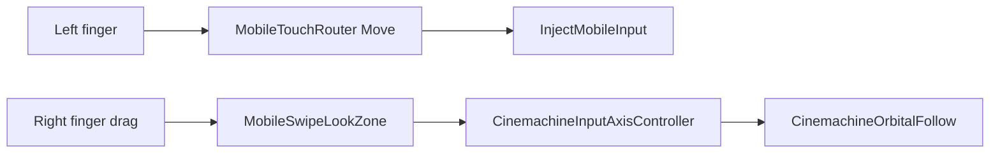

# Hybrid Mobile Look Design (UI Swipe + Cinemachine)

## Problem

Device testing shows `lookOut` and `lookPx` are non-zero while the camera does not rotate. Root cause: `ShouldUseManualMobileLook()` disables `CinemachineInputAxisController` on Android, and `AddLookInput` scales normalized swipe by `sensitivity × unscaledDeltaTime`, producing imperceptible TPP rotation. The previous working checkpoint kept Cinemachine TPP input enabled and used UI `MobileSwipeLookZone` for right-half drag.

Debug overlay falsely reports camera movement when only `LookDelta` is non-zero.

## Goal

1. Restore reliable single-finger swipe camera (TPP) on Android.
2. Keep `MobileTouchRouter` for left-half move only (dual-touch foundation).
3. Fix dual-touch in phase 2: joy hold + right swipe + re-swipe via exclusive pointers.
4. Honest debug: LIVE/latch reflect actual camera axis change.

## Constraints

- Do not edit `Assets/Scenes/SampleScene.unity`.
- Do not change `PlayerController.InjectMobileInput` or `CameraSystem.AddLookInput` signatures.
- Scripts + `MobileJoystickUI.prefab` only.
- New Input System; EnhancedTouch may stay enabled.

## Architecture

| Layer | Responsibility |
|-------|----------------|
| `MobileTouchRouter` | Left 45% screen: one Move finger only. Right half: ignore (no Look binding). |
| `MobileSwipeLookZone` | Right-half UI `IDragHandler`; raycast on invisible graphic. Does not call `AddLookInput` in TPP. |
| `CinemachineInputAxisController` | TPP look on mobile (re-enabled). Reads touch via default input. |
| `MobileInputController` | Bridge move to player; FPP still uses `AddLookInput` from swipe zone if needed; debug overlay. |
| `MobileMoveStickPresenter` | Visual joystick only (unchanged). |

## Data flow (TPP Android)

## Dual-touch rules (phase 2)

- Joystick outer/knob: `raycastTarget = false` (router owns left touch).
- Look zone: `raycastTarget = true` (UI owns right touch).
- Perspective button: raycast on; only control that blocks with `IsPointerOverGameObject` for that pointer.
- Router must not assign `lookFingerId` for right-half contacts.

## CameraSystem change

- `SetTPP()`: `SetInputControllersEnabled(tppEnabled: true, fppEnabled: false)` on all platforms (remove `ShouldUseManualMobileLook` disable path).
- Keep `AddLookInput` for FPP and editor mouse.

## MobileInputController change

- Restore nested `MobileSwipeLookZone` (from pre-router checkpoint).
- `BuildUi` / prefab bind: attach zone to `LookSwipeZone`, enable raycast on capture graphic.
- `Update`: router tick → move only; skip `ApplyLookInput` when TPP; FPP uses swipe zone output + `ApplyLookInput`.
- Debug: LIVE + "camera moves" latch use `CameraSystem` reported yaw delta (or axis snapshot), not `LookDelta`.

## Cutscene (related, low priority)

Intro skip is `PlayerPrefs StoryIntroPlayed`, not disabled. Optional follow-up: single `IntroCutsceneController` instance (avoid bootstrap + prefab duplicate).

## Out of scope

- Full router-only look path.
- `SampleScene.unity` edits.

## Verification (device)

1. Swipe only (TPP): camera rotates smoothly.
2. Joy hold + right swipe: move + camera together.
3. Release right, swipe again while joy held: re-swipe works.
4. Overlay LIVE only green when camera axis actually changes.
